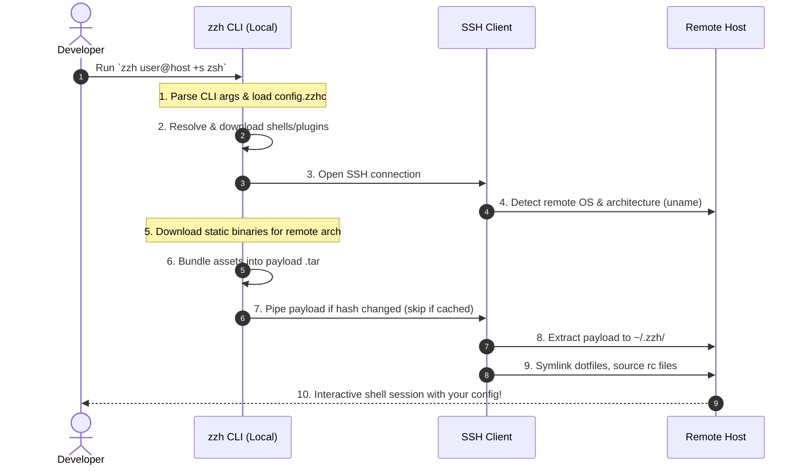

# zzh

[](https://ziglang.org)
[](LICENSE)
[](https://github.com/xxh/xxh)

A zero-dependency, hyper-fast rewrite of the [xxh](https://github.com/xxh/xxh) orchestrator in Zig.

> [!NOTE]
> This project is a fork of the original **xxh** concept, rewritten in Zig to eliminate local Python dependencies, reduce execution times, and provide a single, statically-linked binary.

---

## What is zzh?

`zzh` allows you to bring your favorite interactive shell (e.g., `zsh`, `fish`, `bash`, `nu`, `xonsh`) along with all your custom configurations, themes, and plugins to any remote host you connect to via SSH — without requiring administrative privileges, pre-installation on the remote host, or local Python dependencies.


---



---

## How is zzh different from xxh?

While `zzh` maintains strict compatibility with the `xxh` ecosystem (it downloads and uses original `xxh` shells and plugins directly), it is built entirely differently under the hood:

| Feature | xxh | zzh |
|---|---|---|
| **Runtime** | Python 3 required locally | Single static Zig binary, zero deps |
| **Speed** | Copies files via Python loops | SHA-256 payload hash + tarball caching |
| **SSH handshake** | `pexpect` terminal simulation | Native pipe → PTY swap |
| **OS detection** | Separate SSH round trip | Folded into bootstrap connection |
| **Platforms** | Linux/macOS | Linux, macOS, Windows, ARM |
| **Tmux** | Manual setup | `++tmux` auto-provisions portable static binary |
| **Static Binaries** | Not built-in | Auto-searches GitHub, downloads, caches, and uploads for remote arch |
| **Dotfile sync** | Not built-in | `+d ~/.bashrc` syncs, symlinks, and auto-sources on remote |
| **Shell rc sourcing** | Not built-in | Automatic for bash, zsh, fish, nu, xonsh |
| **Plugin builds** | Sequential | Parallel concurrent `build.sh` execution |

---

## Features

- **Statically Linked Binary** — No runtime dependencies. One binary, runs anywhere.
- **Ultra-Fast Connections** — SHA-256 payload hash skips re-upload when nothing changed.
- **Single SSH Round Trip** — OS/architecture detection is folded into the bootstrap connection, not a separate handshake.
- **Parallel Plugin Builds** — Plugin `build.sh` scripts run concurrently using Zig threads.
- **Static Binary Provisioning** — `+b ripgrep` searches GitHub, detects remote architecture, downloads the right musl/gnu binary, caches it locally, and uploads it. No root required.
- **Portable Tmux** — `++tmux` auto-provisions a static `tmux` binary on the remote. Sessions survive SSH disconnects.
- **Dotfile Sync with Auto-Sourcing** — `+d ~/.bashrc` bundles your dotfile, symlinks it to `~/` on the remote, and ensures your shell sources it immediately. Works correctly for `bash`, `zsh`, `fish`, `nushell`, and `xonsh`.
- **Auto-Updater** — `++update` runs `git pull --rebase` on all locally cached shells and plugins.
- **Shell Completions** — Tab completions for Zsh, Bash, and Nushell included in `completions/`.
- **Ecosystem Compatibility** — 100% compatible with upstream `xxh` shells and plugins.

---

## Getting Started

### Prerequisites

To build `zzh` from source you need **Zig 0.13.0**.

If you use [mise-en-place](https://mise.jdx.dev/), the tool version is configured automatically via `mise.toml`.

### Building from Source

```bash
# Debug build
zig build

# Release build (optimized)
zig build -Doptimize=ReleaseSmall
```

The compiled binary will be placed in `zig-out/bin/zzh`.

### Running Tests

```bash
# Unit and integration tests
zig build test

# End-to-end tests (requires Docker)
zig build e2e
```

---

## Configuration

`zzh` reads configuration from `~/.config/zzh/config.zzhc`. Scaffold a default file with:

```bash
zzh ++config-init
```

### Config File Format

```yaml
# zzh Configuration File (config.zzhc)
#
# Host names are matched using wildcard/glob patterns and merged sequentially.
# CLI arguments always override config file values.

settings:
  local_zzh_home: "~/.zzh"                  # Local package and binary cache
  host_zzh_home: "~/.zzh"                   # Remote deployment directory
  config_path: "~/.config/zzh/config.zzhc"  # Path to this file

hosts:
  # Applied to every connection
  ".*":
    +s: bash
    +d:
      - ~/.bashrc
      - ~/.bash_aliases
    # +b:
    #   - ripgrep        # searched on GitHub automatically
    #   - bat
    #   - jq
    # ++tmux: true

  # Production servers
  # "prod-server-*":
  #   ++tmux: true
  #   ++tmux-session: prod
  #   +b:
  #     - ripgrep
  #     - fd
```

> [!TIP]
> Config file settings are applied first. CLI arguments always win. This means `zzh host +s fish` overrides `+s: bash` from config for that session.

---

## Usage

Use `zzh` exactly like `ssh` — standard SSH flags work as-is. Add `+` prefixed flags for zzh-specific features.

### Basic Connection

```bash
# Connect with zsh
zzh user@host +s zsh

# Connect with nushell
zzh user@host +s nu

# Connect using a specific key and port
zzh -i ~/.ssh/id_rsa -p 2222 user@host +s zsh

# Connect with a password
zzh user@host +s zsh ++password mypassword

# Connect and force reinstall shell/plugins
zzh user@host +s zsh +if

# Connect and wipe the entire remote zzh home first
zzh user@host +s zsh +iff
```

### Dotfile Sync — `+d`

`+d` bundles local configuration files in the payload and symlinks them into `~/` on the remote host. Your shell sources them automatically.

```bash
# Sync bashrc (symlinked as ~/.bashrc on remote)
zzh user@host +s bash +d ~/.bashrc

# Sync multiple files
zzh user@host +s bash +d ~/.bashrc +d ~/.bash_aliases

# Sync with explicit remote name (local:remote syntax)
zzh user@host +s bash +d ~/.bashrc:.bashrc

# Sync an entire config directory
zzh user@host +s zsh +d ~/.config/nvim
```

**Auto-sourcing by shell:**

| Shell | RC file sourced automatically |
|---|---|
| `bash` | `~/.bashrc`, `~/.bash_aliases`, `~/.bash_profile` |
| `zsh` | `~/.zshrc`, `~/.zprofile` |
| `fish` | `~/.config/fish/config.fish` |
| `nushell` | `~/.config/nushell/config.nu` |
| `xonsh` | `~/.xonshrc` |

Your custom PS1, aliases, and functions are active immediately on the remote without any manual setup.

**Safety features:**
- **Side-by-side diffs** — if a remote file differs from your local one, zzh prints a diff before touching anything.
- **Interactive prompt** — asks `Overwrite on remote? [y/N]` before applying changes. Auto-overwrites in non-interactive environments.
- **Backup on overwrite** — the old remote file is moved to `<name>.zzh-bak` before replacement.
- **Obsolete cleanup** — if you remove a dotfile from the command, zzh removes the stale symlink and restores any backup on next connect.

### Static Binary Provisioning — `+b`

Install any static binary on the remote host — no root required, no package manager.

```bash
# Install ripgrep (auto-detects remote architecture)
zzh user@host +s bash +b ripgrep

# Install multiple tools
zzh user@host +s bash +b ripgrep +b fd +b bat +b jq

# Install a specific version
zzh user@host +s bash +b zyedidia/micro@v2.0.14

# Install from a direct URL
zzh user@host +s bash +b https://example.com/tools/mytool.tar.gz
```

**How it works:**
1. zzh detects the remote OS and architecture via `uname` in the bootstrap connection.
2. For short names like `ripgrep` or `bat`, zzh searches the GitHub API and picks the best matching repo.
3. For `owner/repo` inputs, zzh queries the GitHub Releases API directly.
4. The correct asset is selected by matching OS and architecture (handles `x86_64`/`amd64`, `aarch64`/`arm64`, musl vs gnu, etc.).
5. The binary is downloaded and cached locally at `~/.zzh/bin/<name>`.
6. It is bundled in the payload and placed at `~/.zzh/bin/<name>` on the remote.
7. `~/.zzh/bin/` is automatically prepended to `$PATH` in your remote shell.

Binaries at `~/.zzh/bin/` survive `+if` reinstalls — they are stored outside the payload directory.

> [!NOTE]
> If a binary is already cached locally at `~/.zzh/bin/<name>`, zzh skips the download and bundles the cached copy directly. Use `+if` to force a fresh download.

> [!WARNING]
> `.rar` archives are not supported. Use `.tar.gz` or `.zip` archives.

**Deploying a locally built binary:**

```bash
# Copy your binary into the local zzh cache
cp ./mybinary ~/.zzh/bin/mybinary

# zzh will detect it, skip the download, and upload it
zzh user@host +b mybinary
```

### Portable Tmux — `++tmux`

```bash
# Connect with auto-provisioned tmux session
zzh user@host +s zsh ++tmux

# Use a named session (default: zzh)
zzh user@host +s zsh ++tmux ++tmux-session myproject

# Reconnect and re-attach to an existing session
zzh user@host +s zsh ++tmux ++tmux-session myproject
```

On first use, zzh downloads a static `tmux` binary for the remote architecture and places it at `~/.zzh/bin/tmux` on the remote. Sessions survive SSH disconnects — reconnecting automatically re-attaches.

The `tmux` binary persists across `+if` reinstalls.

### Plugins — `+I`

```bash
# Install and use a plugin
zzh user@host +s zsh +I xxh-plugin-zsh-ohmyzsh

# Multiple plugins
zzh user@host +s zsh +I xxh-plugin-zsh-ohmyzsh +I xxh-plugin-zsh-autosuggestions

# Install locally without connecting
zzh +I xxh-plugin-zsh-powerlevel10k

# List all installed packages
zzh +L
```

### Remote Command Execution

```bash
# Run a command and exit
zzh user@host +s bash +hc "uname -a"

# Run a local script on remote
zzh user@host +s bash +hf ./setup.sh
```

### Package Management

```bash
# Install a shell or plugin locally
zzh +I xxh-shell-fish
zzh +I xxh-plugin-zsh-ohmyzsh

# Install portable tmux locally
zzh +I tmux

# Remove a cached package or binary
zzh +R xxh-plugin-zsh-ohmyzsh
zzh +R ripgrep

# Update all cached packages
zzh ++update

# List installed shells / plugins / binaries
zzh +LS
zzh +LP
zzh +LB
```

### Shell Completions

```bash
# Zsh — copy to a directory in $fpath
cp completions/_zzh ~/.zsh/completions/

# Bash — source in ~/.bashrc
source completions/zzh.bash

# Nushell — add to config.nu
use completions/zzh.nu
```

---

## Argument Reference

### SSH Arguments (passed through to ssh)

| Argument | Description |
|---|---|
| `-p <port>` | SSH port |
| `-i <key>` | SSH identity file |
| `-l <user>` | SSH login name |
| `-J <host>` | SSH jump host |
| `-o <opt>` | SSH option passthrough |

### Shell & Plugins

| Argument | Description |
|---|---|
| `+s, ++shell <name>` | Shell to use (`bash`, `zsh`, `fish`, `nu`, `xonsh`) |
| `+I, ++install-zzh-packages <pkg>` | Install xxh shell or plugin locally |
| `+RI, ++reinstall-zzh-packages <pkg>` | Reinstall a cached package |
| `+R, ++remove-zzh-packages <pkg>` | Remove a cached package or binary |
| `+L, ++list-zzh-packages` | List all installed packages |
| `+LS` / `+LP` / `+LB` | List installed shells / plugins / static binaries |
| `++update` | Update all cached packages via `git pull` |

### Files & Dotfiles

| Argument | Description |
|---|---|
| `+d, ++dotfile <file[:name]>` | Sync dotfile — bundled in payload and symlinked to `~/` on remote |
| `+b, ++binary <repo\|url>` | Install static binary from GitHub releases or direct URL |

### Session

| Argument | Description |
|---|---|
| `++tmux` | Attach to persistent tmux session (auto-provisions static tmux binary) |
| `++tmux-session <name>` | Tmux session name (default: `zzh`) |
| `++no-tmux` | Disable tmux wrapping |
| `+hc, ++host-execute-command <cmd>` | Run command on remote and exit |
| `+hf, ++host-execute-file <file>` | Run local script on remote and exit |
| `+heb, ++host-execute-bash <b64>` | Run base64-encoded bash command on remote |

### Environment

| Argument | Description |
|---|---|
| `+e, ++env <NAME=VAL>` | Set environment variable on remote |
| `+eb, ++envb <NAME=B64>` | Set base64-encoded environment variable |

### Installation & Paths

| Argument | Description |
|---|---|
| `+if, ++install-force` | Force reinstall payload (preserves `~/.zzh/bin/`) |
| `+iff, ++install-force-full` | Wipe and reinstall entire remote zzh home |
| `+lh, ++local-zzh-home <path>` | Override local zzh cache directory (default: `~/.zzh`) |
| `+hh, ++host-zzh-home <path>` | Override remote zzh deployment directory (default: `~/.zzh`) |
| `+hhr, ++host-zzh-home-remove` | Ephemeral mode: remove remote payload after disconnect |
| `+hhh, ++host-home <path>` | Override remote home directory |
| `+hhx, ++host-home-xdg <path>` | Override remote XDG config home |

### Auth & Config

| Argument | Description |
|---|---|
| `++password <pass>` | SSH password |
| `++password-prompt` | Prompt securely for SSH password |
| `+xc, ++zzh-config <path>` | Path to config.zzhc file |
| `++config-init` | Scaffold default config under `~/.config/zzh/` |

### Debugging

| Argument | Description |
|---|---|
| `++debug, --debug` | Enable debug output |
| `++time, --time` | Show timing breakdown for each phase |
| `+v, ++verbose` | Verbose output |
| `+vv, ++vverbose` | Super verbose output |
| `+q, ++quiet` | Suppress informational output |

---

## How Payload Caching Works

zzh avoids redundant uploads by computing a SHA-256 hash of your current session parameters — shell name, plugins, dotfile paths, and binary names. This hash is stored on the remote at `~/.zzh/.payload_hash`.

On reconnect, zzh sends the hash to the remote in the bootstrap command. If it matches, the upload is skipped entirely and you connect in under a second. If it differs (new shell, new dotfile, new binary), the payload is rebuilt and uploaded.

> [!TIP]
> If you edit the **contents** of a dotfile without changing its path, the hash won't change and zzh will reuse the cached payload. Run with `+if` to force a fresh upload.

---

---

## License

This project is licensed under the MIT License — see the LICENSE file for details.
