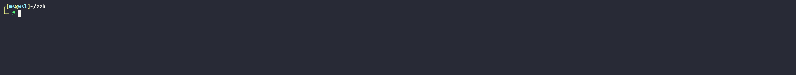
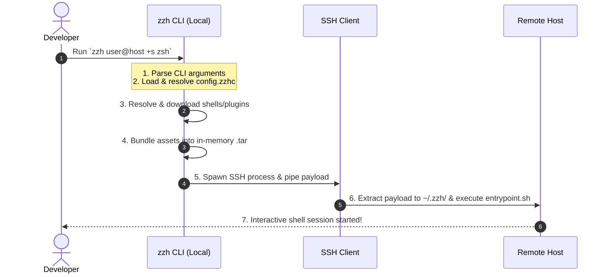

# zzh

[](https://ziglang.org)
[](LICENSE)
[](https://github.com/xxh/xxh)

A zero-dependency, hyper-fast rewrite of the [xxh](https://github.com/xxh/xxh) orchestrator in Zig.


> [!NOTE]
> This project is a fork of the original **xxh** concept, rewritten in Zig to eliminate local Python dependencies, reduce execution times, and provide a single, statically-linked binary.

---

## What is zzh?

`zzh` allows you to bring your favorite interactive shell (e.g., `zsh`, `fish`, `bash`, `nu`) along with all your custom configurations, themes, and plugins to any remote host you connect to via SSH. It does this without requiring administrative privileges, pre-installation on the remote host, or local Python dependencies.




---




---

## How is zzh different from xxh?

While `zzh` maintains strict compatibility with the `xxh` ecosystem (it downloads and uses original `xxh` shells and plugins perfectly), it is built entirely differently under the hood:

| Feature | xxh | zzh |
|---|---|---|
| **Runtime** | Python 3 required locally | Single static Zig binary, zero deps |
| **Speed** | Copies files via Python loops | SHA-256 payload hash + tarball caching |
| **SSH handshake** | `pexpect` terminal simulation | Native pipe → PTY swap |
| **Platforms** | Linux/macOS | Linux, macOS, Windows, ARM |
| **Tmux** | Manual setup | `++tmux` auto-provisions portable binary |
| **Static Binaries** | Downloads shells/plugins (no Tmux) | Auto-downloads, caches, and uploads shells, plugins, and Tmux static binaries |
| **Dotfile sync** | Not built-in | `+d ~/.vimrc` syncs & symlinks to `~/` |
| **Shell completions** | Not built-in | Zsh, Bash, Nushell included |

---

## Features

- **Statically Linked Binary**: No runtime dependencies on Python or external libraries.
- **Ultra Fast Performance**: Immediate start-up times powered by Zig's minimal runtime.
- **Payload Caching**: Cryptographic SHA-256 hash prevents redundant re-uploads on reconnect.
- **Parallel Plugin Builds**: Plugin `build.sh` scripts run concurrently using Zig threads.
- **Static Binary Provisioning**: Automatically downloads, caches locally, and uploads statically compiled shells, plugins, and custom tools (like `tmux`) tailored for the remote target architecture.
- **Portable Tmux**: `++tmux` auto-downloads a static `tmux` binary and provisions it on the remote. Sessions persist across disconnects.
- **Dotfile Sync**: `+d <file>` bundles local dotfiles and symlinks them into remote `~/` automatically.
- **Auto-Updater**: `++update` runs `git pull --rebase` on all locally cached shells and plugins.
- **Shell Completions**: Tab completions for Zsh, Bash, and Nushell included in `completions/`.
- **Ecosystem Compatibility**: 100% compatible with upstream `xxh` shells and plugins.

---

## Getting Started

### Prerequisites

To build `zzh` from source, you need **Zig 0.13.0**.

If you use [mise-en-place](https://mise.jdx.dev/), the tool version is configured automatically via `mise.toml`.

### Building from Source

```bash
# Debug Build
zig build

# Release Build (Optimized for Speed)
zig build -Doptimize=ReleaseSmall
```

The compiled binary will be placed in `zig-out/bin/zzh`.

### Running Tests

```bash
# Unit tests
zig build test

# End-to-end tests (requires Docker)
zig build e2e
```

---

## Configuration

`zzh` looks for configuration files at `~/.config/zzh/config.zzhc`. You can scaffold a default configuration file with:

```bash
zzh ++config-init
```

Here is an example `config.zzhc` structure:

```yaml
# zzh Configuration File (config.zzhc)

# Global settings
settings:
  local_zzh_home: "~/.zzh"                 # Path to local zzh packages and binary cache
  host_zzh_home: "~/.zzh"                  # Target remote execution directory
  config_path: "~/.config/zzh/config.zzhc" # Path to this configuration file

# Custom download links for static binaries.
# Bypasses the GitHub API lookup when downloading binaries using the '+b' flag.
bin_urls:
  - BurntSushi/ripgrep
  - sharkdp/fd

hosts:
  # Matches any host you connect to
  ".*":
    +s: zsh               # Use zsh as the default portable shell
    +hhh: "~"             # Set target home directory to "~"

  # Matches connections to localhost
  "127.0.0.1":
    -p: 2222              # Use port 2222 for local test container
    +if:                  # Force reinstall xxh packages
    +e:                   # Inject environment variables
      - OSH_THEME="powerlevel10k"
```

---

## Usage

Use `zzh` exactly like you would use `ssh`. Simply prefix standard SSH commands or add `zzh`-specific arguments:

### Basic Connection

```bash
# Connect with zsh
zzh user@host +s zsh

# Connect with nushell
zzh user@host +s nu

# Connect using a specific key and port
zzh -i ~/.ssh/id_rsa -p 2222 user@host +s zsh

# Connect using a password
zzh user@host +s zsh ++password mypassword
```

### Plugins

```bash
# Install and load a plugin for this session
zzh user@host +s zsh +I xxh-plugin-zsh-ohmyzsh

# Multiple plugins at once
zzh user@host +s zsh +I xxh-plugin-zsh-ohmyzsh +I xxh-plugin-zsh-autosuggestions

# Install plugin locally without connecting
zzh +I xxh-plugin-zsh-powerlevel10k

# List all locally installed packages
zzh +L
```

### Sending Files & Configs to Remote

`zzh` has two mechanisms for getting local files onto the remote host:

#### `+d` — Dotfile Sync (symlink to `~/`)

Bundles local configuration files or directories in the payload and symlinks them to the remote user's home directory.

```bash
# Sync local bashrc to remote as .bashrc
zzh user@host +d ~/.bashrc:.bashrc

# Sync multiple files
zzh user@host +d ~/.bashrc:.bashrc +d ~/.bash_aliases:.bash_aliases

# Sync an entire config directory — available as ~/.config/nvim on remote
zzh user@host +s zsh +d ~/.config/nvim
```

`zzh` supports a `local:remote` mapping syntax:
- `+d ~/.bashrc` -> symlinks to `~/bashrc` on remote (basename)
- `+d ~/.bashrc:.bashrc` -> symlinks to `~/.bashrc` on remote (explicit name)

**Automatic Sourcing**: The built-in `bash` and `zsh` shells in `zzh` are pre-configured to automatically source `~/.bashrc` and `~/.zshrc` respectively, if they exist in the remote home directory. This ensures your custom prompts (`PS1`), aliases, and functions are active immediately.

`zzh` handles dotfiles with robust safety and synchronization features:


* **Obsolete Cleanup**: If you sync dotfiles in one connection and remove them from the command in the next, `zzh` automatically detects this, cleans up the obsolete symlink, and restores any original backup file.
* **Side-by-Side Diffs**: If a remote file/directory differs from the incoming local one, `zzh` prints a side-by-side (two-panel) diff (or falls back to a unified diff on BusyBox/minimal hosts) so you can review changes.
* **Interactive Prompts**: It prompts you for confirmation (`Overwrite on remote? [y/N]`) before applying the change. In non-interactive environments (scripts/automated tasks), it bypasses prompting and auto-overwrites safely.
* **Backup & Restore**: When overwriting, `zzh` moves the old file/directory to `<name>.zzh-bak`. If the contents match the local files exactly, no redundant backup is created.

#### Coming soon: `+f local:remote/path` — Explicit File Placement

For files that need to go to a **specific remote path** rather than `~/` (e.g., a tool config at `~/.config/ripgrep/ripgreprc`):

```bash
# Place a file at an explicit remote path (planned)
zzh user@host +s zsh +f ~/.config/ripgrep/ripgreprc:~/.config/ripgrep/ripgreprc
zzh user@host +s zsh +f ./server.conf:~/.config/myapp/server.conf
```

For now, `+d` covers the vast majority of use cases since most tools respect `~/.<name>` dotfile conventions.

### Portable Tmux

`zzh` can provision a fully portable, static `tmux` binary on the remote host with no system installation required. Sessions survive SSH disconnects — reconnecting automatically re-attaches.

```bash
# Connect with auto-provisioned tmux session (downloads tmux if needed)
zzh user@host +s zsh ++tmux

# Use a named session (default name: zzh)
zzh user@host +s zsh ++tmux ++tmux-session myproject

# Reconnect and re-attach to existing session
zzh user@host +s zsh ++tmux ++tmux-session myproject

# Install tmux binary locally without connecting (optional - ++tmux does this automatically)
zzh +I tmux
```

**How it works:**
- On first use, `zzh` downloads a static `tmux` binary (`~/.zzh/bin/tmux`) for the remote architecture.
- The binary is bundled in the payload and placed at `~/.zzh/bin/tmux` on the remote — **outside** the payload directory, so it persists across `+if` reinstalls.
- The shell entrypoint is automatically wrapped in `tmux new-session -A -s <session>`.

### Static Binary Provisioning — `+b`

Install any static binary (from GitHub releases, custom URLs, or local files) directly on the remote host — no root required, no package manager, fully portable.

```bash
# Install ripgrep on remote (auto-detects remote arch)
zzh user@host +s zsh +b BurntSushi/ripgrep

# Install multiple tools
zzh user@host +s zsh +b BurntSushi/ripgrep +b sharkdp/fd +b sharkdp/bat

# Install a specific version
zzh user@host +s zsh +b zyedidia/micro@v2.0.14

# Install from full URL
zzh user@host +s zsh +b https://github.com/zyedidia/micro
```

#### Custom & Archive URLs
You can download binaries directly from custom servers or specific release assets. `zzh` supports extracting binaries from `.tar.gz`, `.tgz`, and `.zip` archive formats:

* **Direct URL on Command Line**:
  ```bash
  zzh user@host +b https://example.com/bin/fd.tar.gz
  ```
  *(Note: Passing direct URLs on the command line will cache the executable on the remote using the URL's filename, e.g. `fd.tar.gz`.)*

* **Via Configuration File (Recommended)**:
  To keep your remote commands clean, map a binary's name to its URL under `bin_urls` in `~/.config/zzh/config.zzhc`:
  ```yaml
  bin_urls:
    fd: "https://example.com/bin/fd.tar.gz"
  ```
  Then connect specifying only the clean name:
  ```bash
  zzh user@host +b fd
  ```
  `zzh` will download the archive, extract the `fd` executable, and place it directly in `~/.zzh/bin/fd`.

> [!WARNING]
> `.rar` archives are NOT supported. `zzh` uses standard system `tar` commands for extraction. Since `tar` does not natively support the proprietary RAR format, you should package your files as `.tar.gz` or `.zip` archives.

#### Deploying Local/Custom Binaries
If you have a binary already compiled on your local machine that you want to send to the remote:
1. Copy or symlink the local binary into your local `zzh` bin cache directory (defaults to `~/.zzh/bin/`):
   ```bash
   cp /home/user/fd ~/.zzh/bin/fd
   ```
2. Run `zzh` specifying the binary name:
   ```bash
   zzh user@host +b fd
   ```
`zzh` will detect that `fd` is already present locally, skip downloading, bundle it, and upload it to `~/.zzh/bin/fd` on the remote host.

**How it works:**
- zzh probes the remote's architecture and OS (`uname -m`, musl vs glibc) via a quick SSH check
- Queries the GitHub Releases API (or your configured URL) to find the correct pre-built asset
- Downloads and caches the binary locally at `~/.zzh/bin/<name>`
- Bundles it in the payload at tarball root `bin/<name>` → permanent at `~/.zzh/bin/<name>` on remote
- `~/.zzh/bin/` is automatically added to `$PATH` in your remote shell
- Survives `+if` reinstalls (just like `++tmux`)

**Key difference from `+I`:**
| | `+I xxh-plugin-*` | `+b repo/tool` |
|---|---|---|
| Source | xxh ecosystem git repos | Any GitHub/GitLab release / Custom URL / Local file |
| Format | xxh plugin structure | Plain static binary |
| Location | `~/.zzh/.zzh/plugins/` | `~/.zzh/bin/` |
| Persistence | Wiped on `+if` | Survives `+if` |
| Purpose | Shell integrations | CLI tools in PATH |

### Auto-Update Packages

```bash
# Run git pull --rebase on all locally cached shells and plugins
zzh ++update
```

### Remote Command Execution

```bash
# Run a command on remote and exit
zzh user@host +s zsh +hc "ls -la ~/"

# Run a local script on remote
zzh user@host +s zsh +hf ./setup.sh

# Execute without interactive shell
zzh user@host +s zsh +hc "uname -a"
```

### Package Management

```bash
# Install a shell locally
zzh +I xxh-shell-fish

# Install a plugin locally
zzh +I xxh-plugin-zsh-ohmyzsh

# Install portable tmux
zzh +I tmux

# Remove a package or static binary from cache
zzh +R xxh-plugin-zsh-ohmyzsh
zzh +R tmux

# List installed shells
zzh +LS

# List installed plugins
zzh +LP

# List installed static binaries
zzh +LB
```

### Shell Completions

Copy the appropriate completion file to your shell's completion directory:

```bash
# Zsh — copy to a directory in $fpath
cp completions/_zzh ~/.zsh/completions/

# Bash — source in ~/.bashrc
source completions/zzh.bash

# Nushell — add to config.nu
use completions/zzh.nu
```

---

### Argument Reference

| Argument | Description |
|---|---|
| `+s, ++shell <name>` | Shell to use (`zsh`, `fish`, `nu`, `xonsh`, `bash`) |
| `+I <pkg>` | Install xxh package (`xxh-plugin-*`, `xxh-shell-*`, or `tmux`) |
| `+b, ++binary <repo>` | Install static binary from GitHub releases |
| `+d, ++dotfile <file>` | Sync dotfile/config — symlinked to `~/` on remote |
| `+R, ++remove-zzh-packages <pkg>` | Remove cached package or binary |
| `+L, ++list-zzh-packages` | List installed packages |
| `+LS` / `+LP` / `+LB` | List installed shells / plugins / static binaries |
| `++update` | Update all cached packages via `git pull` |
| `++tmux` | Attach to persistent tmux session (auto-downloads tmux) |
| `++tmux-session <name>` | Tmux session name (default: `zzh`) |
| `++config-init` | Scaffold a default configuration file under `~/.config/zzh/` |
| `+hh <path>` | Remote path to deploy payload to (default: `~/.zzh`) |
| `+hhr` | Ephemeral mode: automatically remove payload from remote after disconnect (guaranteed client-side cleanup) |
| `+if` / `+iff` | Force reinstall payload / full home |
| `+hc <cmd>` | Execute command on remote and exit |
| `+hf <file>` | Execute local script on remote and exit |
| `-p <port>` | SSH port |
| `-i <key>` | SSH identity file |
| `-l <user>` | SSH login name |
| `-J <host>` | SSH jump host |
| `-o <opt>` | SSH option passthrough |
| `++password <pass>` | SSH password |
| `++time` | Show timing breakdown |
| `-v` / `-vv` | Verbose / super verbose output |

---

## License

This project is licensed under the MIT License - see the LICENSE file for details.
