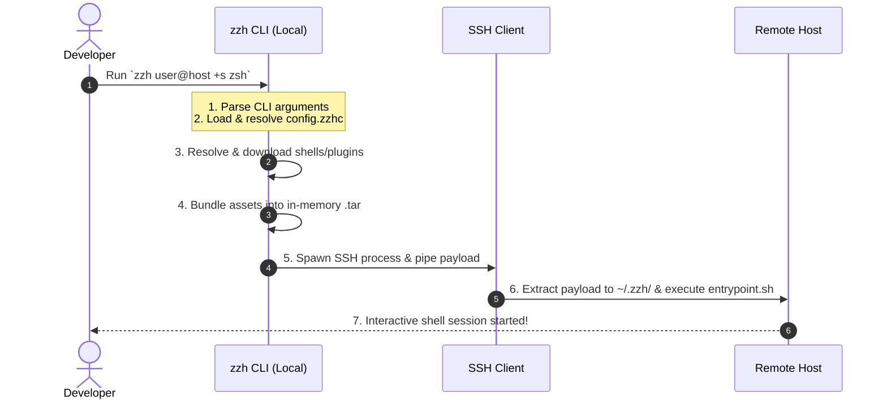

# zzh

[](https://ziglang.org)
[](LICENSE)
[](https://github.com)

A zero-dependency, hyper-fast rewrite of the [xxh](https://github.com/xxh/xxh) orchestrator in Zig. 

> [!NOTE]
> This project is a fork of the original **xhh** (or `xhh-zig`) project, which ported `xxh` to Zig to eliminate local Python dependencies, reduce execution times, and provide a single, statically-linked binary.

---

## What is zzh?

`zzh` allows you to bring your favorite interactive shell (e.g., `zsh`, `fish`, `bash`, `nu`) along with all your custom configurations, themes, and plugins to any remote host you connect to via SSH. It does this without requiring administrative privileges, pre-installation on the remote host, or local Python dependencies.



---

## How is zzh different from xxh?

While `zzh` maintains strict compatibility with the `xxh` ecosystem (it downloads and uses original `xxh` shells and plugins perfectly), it is built entirely differently under the hood:

- **Zero Python Dependency**: `xxh` requires Python 3 to be installed locally to run its complex orchestrator scripts. `zzh` is a single, statically-linked Zig binary that runs out-of-the-box on any machine.
- **Blazing Fast Local Execution**: `xxh` copies thousands of plugin and shell files around locally using Python loops. `zzh` computes a cryptographic payload hash and implements **Payload Tarball Caching**. The first time you connect, the tarball is cached locally. Future connections bypass local filesystem iteration entirely and push the pre-compiled payload instantly.
- **Streamlined SSH Architecture**: `xxh` uses Python's `pexpect` module to simulate a terminal session for payload deployment, which can be brittle. `zzh` natively pipes the deployment tarball over standard SSH data streams before swapping you into an interactive PTY.
- **Cross-Platform**: Because `zzh` is written in Zig, it supports native `ReleaseSmall` compilations for Windows, Linux, and macOS (including ARM variants) out of the box with zero runtime libraries required.

---

## Features

- **Statically Linked Binary**: No runtime dependencies on Python or external libraries.
- **Ultra Fast Performance**: Immediate start-up times and fast execution powered by Zig's minimal, optimized runtime.
- **Piped Archiving**: Files are compressed in memory and piped directly over a single SSH connection.
- **Ecosystem Compatibility**: Works out-of-the-box with the standard `xxh` shells and plugins (e.g., `xxh-shell-zsh`,`xxh-plugin-prerun-zoxide`).

---

## Getting Started

### Prerequisites

To build `zzh` from source, you need **Zig 0.13.0**. 

If you use [mise-en-place](https://mise.jdx.dev/), the tool version is configured automatically via `mise.toml`.

### Building from Source

To compile the application:

```bash
# Debug Build
zig build

# Release Build (Optimized for Speed)
zig build -Doptimize=ReleaseSmall
```

The compiled binary will be placed in `zig-out/bin/zzh`.

### Running Tests

To run the unit tests:

```bash
zig build test
```

---

## Configuration

`zzh` looks for configuration files at `~/.config/zzh/config.zzhc`.

Here is an example `config.zzhc` file:

```yaml
# zzh Demo Configuration File (config.zzhc)
hosts:
  # Matches any host you connect to
  ".*":
    +s: zsh               # Use zsh as the default portable shell
    +hhh: "~"             # Set target home directory to "~"

  # Matches connections to localhost (e.g. root@127.0.0.1)
  "127.0.0.1":
    -p: 2222              # Use port 2222 for local test container
    +if:                  # Force reinstall xxh packages
    +e:                   # Inject environment variables
      - OSH_THEME="powerlevel10k"
```

---

## Usage

Use `zzh` exactly like you would use `ssh`. Simply prefix standard SSH commands or add `zzh`-specific arguments:

```bash
# Connect to host using zsh
zzh user@host +s zsh

# Connect to host using nushell (defaults to xxh-shell-nu)
zzh user@host +s nu

# Connect to host using the alias 'nushell'
zzh user@host +s nushell

# Connect to host using our Nushell shell package via Git
zzh user@host +s nu+git+https://github.com/msenturk/xxh-shell-nu

# Connect to host and pre-install a plugin
zzh user@host +s zsh +I xxh-plugin-zsh-ohmyzsh
```


### Argument Syntax

Arguments starting with `+` are interpreted by `zzh` (e.g., `+s` for selecting the shell, `+I` for installing plugins). All other arguments are passed directly to the underlying `ssh` process.

---

## License

This project is licensed under the MIT License - see the LICENSE file for details.
